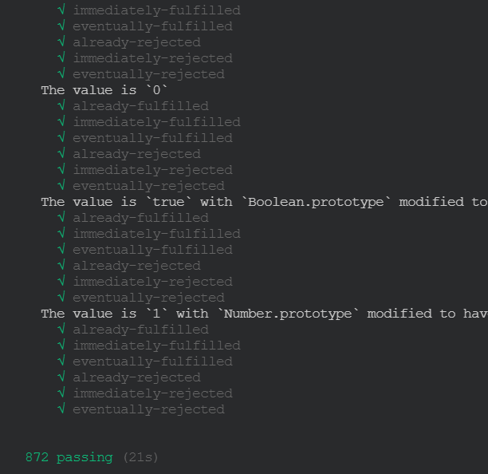

### promise

- promise是干什么的？
- 如何使用
- promise A+ 测试

#### promise是干什么的？

promise是为了解决回调地狱问题而产生的。地狱回调长什么样子呢？

```js
$.ajax(url1,function(data1){
	$.ajax(url2,function(data2){
		$.ajax(url3,function(data3){
			$.ajax(url4,function(data4){
				doSomeThing();
			})
		})
	})
})
```

#### 如何使用？

```js
function getData(url){
    return new Promise((resolve,reject)=>{
        $.ajax(url,function(data1){
            resolve(data1)
        })
    })
}
getData(url1).then((data)=>{
    return getData(url2);
}).then((data)=>{
    return getData(url3);
}).then((data)=>{
    return getData(url4);
}).then((data)=>{
    doSomeThing();
})
```

#### promise A+ 测试

```bash
npm run test
```


